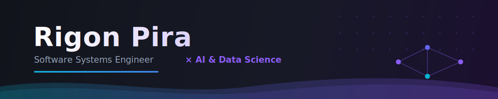

<!--
============================================================
  README for GitHub Profile — Rigon Pira
  ✅  GitHub username: rigonp
  📌  Must live in a public repo named exactly  rigonp/rigonp
  🎨  Custom assets:  ./assets/banner.svg  ·  ./assets/divider.svg
  🔗  LinkedIn handle is "rigonpira" (not the GitHub username)
============================================================
-->

<div align="center">

<!-- ░░ HERO ░░ Custom animated banner (assets/banner.svg) -->


<br/>

<!-- ░░ SOCIAL ░░ -->
<a href="https://www.linkedin.com/in/rigonpira/">
  
</a>
<a href="mailto:pira.rigon@gmail.com">
  
</a>
<a href="mailto:rigon.pira@ubt-uni.net">
  
</a>


<br/><br/>

<!-- ░░ TYPING ░░ -->


</div>


```python
class RigonPira:
    def __init__(self):
        self.role        = "Software Engineer & University Assistant @ UBT"
        self.education   = ["BSc — Software Systems Engineering",
                            "MSc — Data Science & Artificial Intelligence"]
        self.location    = "Prishtina, Kosovo 🇽🇰  ·  Balkans"
        self.languages   = ["Shqip", "English"]
        self.focus       = ["AI / ML", "Data Science", "Full-stack dev", "Research"]

    def current_mission(self):
        return "Bridging rigorous engineering with applied AI — " \
               "and helping the next wave of students do the same."
```


### 🧠 &nbsp; What I do

- 🔬 &nbsp;**Research** — applied work on machine learning and social-network algorithms
- 🤖 &nbsp;**Applied AI** — building ML & NLP systems from prototype to production
- 🌐 &nbsp;**Full-stack** — web apps, backends, and the occasional game
- 🎓 &nbsp;**Teaching** — supervising theses & mentoring the next wave of CS students
- 🌱 &nbsp;**Always exploring** — new models, tooling, and side projects at the edge of AI + software


### 🛠️ &nbsp; Tech Arsenal

<div align="center">

<!-- Compact animated icon strip -->


</div>

<details>
<summary><b>🔎 &nbsp;Full breakdown (click to expand)</b></summary>

<br/>

**Languages**


**AI · ML · Data**


**Backend · Web**


**Data Stores**


**Tools & Engines**


</details>


### 📊 &nbsp; GitHub in Numbers

<div align="center">

<!--
  Stats + languages + 3D contribution calendar are ALL generated by
  .github/workflows/metrics.yml and committed to the repo as github-metrics.svg.
  This renders reliably (no third-party rate-limits).
  Requires: METRICS_TOKEN secret + one run of the "Generate GitHub Metrics" Action.
-->


<br/><br/>

<!-- Contribution activity line graph (live service, renders reliably) -->


</div>


<!--
  🐍 Contribution snake — needs the GitHub Action .github/workflows/snake.yml
  Uses Platane/snk and pushes to the `output` branch.
-->
<div align="center">

<picture>
  <source media="(prefers-color-scheme: dark)"  srcset="https://raw.githubusercontent.com/rigonp/rigonp/output/github-contribution-grid-snake-dark.svg" />
  <source media="(prefers-color-scheme: light)" srcset="https://raw.githubusercontent.com/rigonp/rigonp/output/github-contribution-grid-snake.svg" />
  
</picture>

</div>


### 💬 &nbsp; Dev quote of the day

<div align="center">


</div>


<div align="center">

### 🤝 &nbsp; Let's build something

Open to collaboration on **AI / ML**, **full-stack** projects, and **research**.

**📫 [pira.rigon@gmail.com](mailto:pira.rigon@gmail.com)  ·  [rigon.pira@ubt-uni.net](mailto:rigon.pira@ubt-uni.net)  ·  [LinkedIn](https://www.linkedin.com/in/rigonpira/)**

<br/>

*Thanks for stopping by!* 👋


</div>

<!-- ░░ FOOTER WAVE ░░ -->

